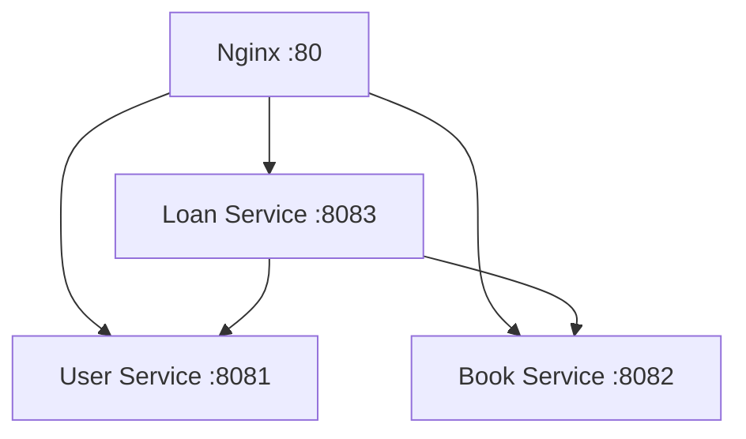

# Smart Library System - Phase 2: Docker Microservices

This is the containerized microservices version of the Smart Library System, featuring four independent services running in Docker containers with orchestration via Docker Compose.

## 🏗️ Architecture Overview

The system is split into four Docker containers:

### 1. **User Service** (`smart-library-user-service`)
- **Purpose**: User registration, authentication, and profile management
- **Port**: 8081 (internal), exposed via Nginx
- **Database**: SQLite (`user_db.sqlite`)
- **Health Check**: `http://127.0.0.1:8081/`
- **Docker Image**: Built from `./user-service/Dockerfile`

### 2. **Book Service** (`smart-library-book-service`)
- **Purpose**: Book catalog management, inventory, and search
- **Port**: 8082 (internal), exposed via Nginx
- **Database**: SQLite (`book_db.sqlite`)
- **Health Check**: `http://127.0.0.1:8082/`
- **Docker Image**: Built from `./book-service/Dockerfile`

### 3. **Loan Service** (`smart-library-loan-service`)
- **Purpose**: Book lending, returns, and loan tracking
- **Port**: 8083 (internal), exposed via Nginx
- **Database**: SQLite (`loan_db.sqlite`)
- **Health Check**: `http://127.0.0.1:8083/`
- **Dependencies**: Communicates with User and Book services
- **Docker Image**: Built from `./loan-service/Dockerfile`

### 4. **Nginx Reverse Proxy** (`smart-library-nginx`)
- **Purpose**: API gateway, load balancing, and routing
- **Port**: 80 (public entry point)
- **Health Check**: `http://127.0.0.1/health`
- **Configuration**: Routes traffic to appropriate microservices
- **Docker Image**: Built from `./nginx/Dockerfile`

## 🐳 Docker Infrastructure

### **Container Network**
- **Network Name**: `phase2_library-network`
- **Subnet**: `172.20.0.0/16`
- **Driver**: Bridge
- **Inter-service Communication**: Services communicate using container names

### **Data Persistence**
- **user-data**: Volume for User Service database
- **book-data**: Volume for Book Service database  
- **loan-data**: Volume for Loan Service database
- **Volumes persist data even when containers are recreated**

### **Service Dependencies**


## 🚀 Quick Start Guide

### **Prerequisites**
- Docker Engine 20.10+
- Docker Compose 2.0+
- Available ports: 80, 8081, 8082, 8083
- 4GB+ RAM recommended
- 2GB+ free disk space

### **Option 1: One-Command Deployment (Recommended)**
```bash
# Start the entire system
./docker-run.sh
```

### **Option 2: Manual Docker Compose**
```bash
# Start all services in detached mode
sudo docker compose up -d

# Monitor startup progress
sudo docker compose ps

# View logs
sudo docker compose logs -f
```

### **Option 3: Step-by-Step Build and Run**
```bash
# Build all Docker images
./docker-build.sh

# Start the services
sudo docker compose up -d

# Check status
sudo docker compose ps
```

## 🔍 Verification & Monitoring

### **Check Service Health**
```bash
# View all container status
sudo docker compose ps

# Expected output:
# NAME                         STATUS
# smart-library-book-service   Up (healthy)
# smart-library-loan-service   Up (healthy)  
# smart-library-nginx          Up (healthy)
# smart-library-user-service   Up (healthy)
```

### **Monitor Logs**
```bash
# All services
sudo docker compose logs -f

# Specific service
sudo docker compose logs -f user-service
sudo docker compose logs -f book-service
sudo docker compose logs -f loan-service
sudo docker compose logs -f nginx
```

### **System Health Check**
```bash
# Test nginx health endpoint
curl http://localhost/health

# Test individual services
curl http://localhost:8081/users
curl http://localhost:8082/books  
curl http://localhost:8083/loans
```

## 🌐 API Access Points

### **Public Entry Point (Recommended)**
- **Base URL**: `http://localhost`
- **Users**: `http://localhost/users`
- **Books**: `http://localhost/books`
- **Loans**: `http://localhost/loans`
- **Returns**: `http://localhost/returns`

### **Direct Service Access (Development)**
- **User Service**: `http://localhost:8081`
- **Book Service**: `http://localhost:8082`
- **Loan Service**: `http://localhost:8083`

## 📖 API Reference

All APIs are accessible through the Nginx proxy at `http://localhost` or directly via service ports.

### **User Service Endpoints**

#### **POST /users**
Create/register a new user.

**Request:**
```json
{
  "name": "Alice Smith",
  "email": "alice@example.com",
  "role": "student"
}
```

**Response:**
```json
{
  "id": 1,
  "name": "Alice Smith",
  "email": "alice@example.com",
  "role": "student",
  "created_at": "2025-06-02T10:00:00Z"
}
```

#### **GET /users/{id}**
Fetch user profile by ID.

**Response:**
```json
{
  "id": 1,
  "name": "Alice Smith",
  "email": "alice@example.com",
  "role": "student",
  "created_at": "2025-06-02T10:00:00Z"
}
```

#### **PUT /users/{id}**
Update user information.

**Request:**
```json
{
  "name": "Alice Johnson",
  "email": "alice.johnson@example.com"
}
```

### **Book Service Endpoints**

#### **POST /books**
Add a new book to the catalog.

**Request:**
```json
{
  "title": "Clean Code",
  "author": "Robert C. Martin",
  "isbn": "9780132350884",
  "copies": 3
}
```

**Response:**
```json
{
  "id": 1,
  "title": "Clean Code",
  "author": "Robert C. Martin",
  "isbn": "9780132350884",
  "copies": 3,
  "available_copies": 3,
  "created_at": "2025-06-02T10:00:00Z"
}
```

#### **GET /books?search=clean**
Search for books by title, author, or keyword.

**Query Parameters:**
- `search`: Search term (optional)
- `limit`: Maximum results (default: 10)
- `offset`: Pagination offset (default: 0)

#### **GET /books/{id}**
Retrieve detailed information about a specific book.

#### **PUT /books/{id}**
Update book information.

#### **PATCH /books/{id}/availability**
Update a book's available copies.

**Request (increment/decrement):**
```json
{
  "operation": "increment"
}
```

**Request (set specific value):**
```json
{
  "available_copies": 4
}
```

#### **DELETE /books/{id}**
Remove a book from the catalog.

### **Loan Service Endpoints**

#### **POST /loans**
Issue a book to a user.

**Request:**
```json
{
  "user_id": 1,
  "book_id": 42,
  "due_date": "2025-07-01T23:59:59Z"
}
```

**Response:**
```json
{
  "id": 1001,
  "user_id": 1,
  "book_id": 42,
  "loan_date": "2025-06-02T10:00:00Z",
  "due_date": "2025-07-01T23:59:59Z",
  "status": "active"
}
```

#### **POST /returns**
Return a borrowed book.

**Request:**
```json
{
  "loan_id": 1001
}
```

**Response:**
```json
{
  "loan_id": 1001,
  "return_date": "2025-06-15T14:30:00Z",
  "status": "returned"
}
```

#### **GET /loans/user/{user_id}**
Get a user's loan history (active and returned books).

#### **GET /loans/{id}**
Get details of a specific loan.

## 🔗 Inter-Service Communication

In this Docker-based architecture:

### **Service Discovery**
- Services communicate using Docker container names
- Example: `http://user-service:8081` instead of `localhost:8081`
- Nginx acts as an API gateway routing external requests

### **Communication Flow**
When issuing a book, the Loan Service:
1. **Validates User**: `GET http://user-service:8081/users/{id}`
2. **Checks Book**: `GET http://book-service:8082/books/{id}`
3. **Updates Inventory**: `PATCH http://book-service:8082/books/{id}/availability`
4. **Creates Loan**: Stores loan record in its own database

### **Circuit Breaker Pattern**
- Protects against cascade failures
- Automatically fails fast when downstream services are unavailable
- Implements retry logic with exponential backoff

## 📊 Production Deployment

### **Environment Variables**
```bash
# Set production environment
export NODE_ENV=production
export PORT_USER=8081
export PORT_BOOK=8082  
export PORT_LOAN=8083
export NGINX_PORT=80
```

### **Docker Registry Deployment**
```bash
# Tag images for registry
docker tag smart-library/user-service your-registry/smart-library-user:v1.0
docker tag smart-library/book-service your-registry/smart-library-book:v1.0
docker tag smart-library/loan-service your-registry/smart-library-loan:v1.0
docker tag smart-library/nginx your-registry/smart-library-nginx:v1.0

# Push to registry
docker push your-registry/smart-library-user:v1.0
docker push your-registry/smart-library-book:v1.0
docker push your-registry/smart-library-loan:v1.0
docker push your-registry/smart-library-nginx:v1.0
```

### **Scaling Services**
```bash
# Scale specific services
docker compose up -d --scale book-service=3
docker compose up -d --scale user-service=2
```

## 🔧 Troubleshooting

### **Common Issues**

#### **Port Already in Use**
```bash
# Check what's using the port
sudo netstat -tulpn | grep :80
sudo netstat -tulpn | grep :8081

# Kill process if needed
sudo kill -9 <PID>
```

#### **Container Won't Start**
```bash
# Check container logs
sudo docker compose logs container-name

# Check Docker daemon
sudo systemctl status docker

# Restart Docker if needed
sudo systemctl restart docker
```

#### **Health Check Failing**
```bash
# Check health status
sudo docker compose ps

# Inspect health check
sudo docker inspect smart-library-book-service | grep -A 10 Health

# Test health check manually
sudo docker compose exec book-service wget --spider http://127.0.0.1:8082/
```

#### **Services Can't Communicate**
```bash
# Check network
sudo docker network ls
sudo docker network inspect phase2_library-network

# Test inter-service connectivity
sudo docker compose exec loan-service ping user-service
sudo docker compose exec loan-service ping book-service
```

### **Performance Optimization**
```bash
# Monitor resource usage
sudo docker stats

# Clean up unused resources
sudo docker system prune

# Optimize images
sudo docker images
sudo docker image prune
```

## 📁 Project Structure

```
Phase 2/
├── 🐳 Docker Files
│   ├── docker-compose.yml       # Service orchestration
│   ├── docker-build.sh          # Build all images
│   ├── docker-run.sh            # Start all services
│   ├── docker-stop.sh           # Stop all services
│   └── docker-test.sh           # Run tests
├── 📚 Microservices
│   ├── user-service/
│   │   ├── Dockerfile           # User service container
│   │   ├── index.js
│   │   ├── package.json
│   │   └── [service files]
│   ├── book-service/
│   │   ├── Dockerfile           # Book service container
│   │   ├── index.js
│   │   ├── package.json
│   │   └── [service files]
│   ├── loan-service/
│   │   ├── Dockerfile           # Loan service container
│   │   ├── index.js
│   │   ├── package.json
│   │   └── [service files]
│   └── nginx/
│       ├── Dockerfile           # Nginx proxy container
│       ├── nginx.conf
│       └── default.conf
├── 🧪 Testing
│   ├── test-microservices.js    # API tests
│   ├── TESTING-REPORT.md        # Test documentation
│   └── test-results/            # Test outputs
└── 📖 Documentation
    ├── README.md                # This file
    └── DOCKER-README.md         # Docker-specific docs
```

## 🚦 Service Lifecycle

### **Startup Order**
1. **Network Creation**: `phase2_library-network`
2. **Volume Creation**: `user-data`, `book-data`, `loan-data`
3. **Service Startup**: User & Book services (parallel)
4. **Dependency Wait**: Loan service waits for User & Book
5. **Proxy Startup**: Nginx waits for all services
6. **Health Checks**: All services report healthy

### **Graceful Shutdown**
```bash
# Graceful shutdown (recommended)
sudo docker compose down

# Force shutdown if needed
sudo docker compose kill
```

## 📈 Monitoring & Observability

### **Health Endpoints**
- **Nginx**: `http://localhost/health`
- **User Service**: `http://localhost:8081/`
- **Book Service**: `http://localhost:8082/`
- **Loan Service**: `http://localhost:8083/`

### **Log Aggregation**
```bash
# View aggregated logs
sudo docker compose logs -f --tail=100

# Service-specific logs  
sudo docker compose logs -f user-service --tail=50
```

### **Metrics Collection**
```bash
# Resource usage monitoring
sudo docker stats --format "table {{.Container}}\t{{.CPUPerc}}\t{{.MemUsage}}\t{{.NetIO}}"
```

## 🛡️ Security Considerations

### **Container Security**
- **Non-root user**: All services run as `nodeuser` (UID 1001)
- **Minimal base image**: Alpine Linux for reduced attack surface
- **Read-only filesystem**: Application code is immutable
- **Network isolation**: Services communicate via dedicated Docker network

### **Data Security**
- **Volume permissions**: Proper ownership and access controls
- **Environment variables**: Sensitive data via Docker secrets (recommended for production)
- **API validation**: Input validation and sanitization at service level

## 📚 Additional Resources

- **[DOCKER-README.md](DOCKER-README.md)**: Docker-specific documentation
- **[TESTING-REPORT.md](TESTING-REPORT.md)**: Comprehensive testing guide
- **[Phase 1 README](../Phase%201/README.md)**: Monolithic version documentation
- **Docker Documentation**: https://docs.docker.com/
- **Docker Compose Reference**: https://docs.docker.com/compose/

---

## 🎉 Quick Commands Reference

```bash
# Start everything
./docker-run.sh

# Check status
sudo docker compose ps

# View logs
sudo docker compose logs -f

# Stop everything
sudo docker compose down

# Test the API
curl http://localhost/health
```

**🚀 Your Smart Library System is now running in Docker containers!**

Access the system at: **http://localhost**
